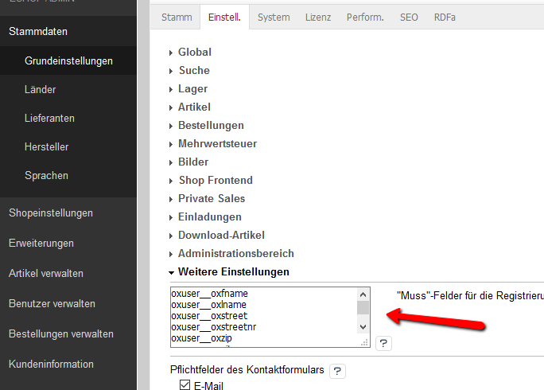

# Oxid mustfillfields

## Description

Now you can define the "must fill fields" by language.
Add the Language ID in front, before the field.

Example: (required in all languages)

    oxuser__oxstreet

Example: (required only in language 1 (English). This can exists more often for different languages)

    1|oxuser__oxstreet

## Install

1. Copy files into following directory

        source/modules/rs/mustfillfields

2. Add to composer.json at shop root

        "autoload": {
            "psr-4": {
                "rs\\mustfillfields\\": "./source/modules/rs/mustfillfields"
            }
        },
    
3. Refresh autoloader files with composer in the oxid root directory.

        composer dump-autoload
        
4. Enable module in the oxid admin area, Extensions => Modules
5. Make your changes in the oxid admin